[](https://pypi.org/project/git-aftermerge/)
[](https://pypi.org/project/git-aftermerge/)
[](https://pypi.org/project/git-aftermerge/)
[](https://github.com/inthepond/git-aftermerge/actions)
[](https://inthepond.github.io/git-aftermerge/)
[](https://opensource.org/licenses/MIT)
[](https://github.com/astral-sh/ruff)

# git-aftermerge

> Track the downstream fate of every commit. Feed structured post-merge feedback to AI coding agents.



## What This Is

`git-aftermerge` is a Python CLI + MCP server that analyzes what happens to code *after* it gets merged — tracking survival, reverts, churn, and bug-fix correlations — then feeds structured feedback back to coding agents so they learn from their own history.

## Installation

```bash
pip install git-aftermerge
```

## Quick Start

```bash
# Initialize in your repo
cd /path/to/your/repo
git-aftermerge init

# Check fate of a specific commit
git-aftermerge fate abc1234

# View aggregate patterns
git-aftermerge report

# Generate agent context file
git-aftermerge context --output .aftermerge/CONTEXT.md
```

Then in `CLAUDE.md`:

```markdown
## Post-Merge Context
See .aftermerge/CONTEXT.md for code survival data and risky areas.
```

## How It Works

1. **Scan** — parses git history, runs `git blame` to track line-level survival
2. **Score** — computes a 0–100 survival score per commit with penalties (reverts, bug-fixes) and bonuses (longevity, extensions)
3. **Detect** — finds reverts (standard + manual), bug-fix correlations, and churn spikes
4. **Aggregate** — rolls up patterns by path, author, commit type, size, and language
5. **Serve** — exposes everything via CLI, JSON, markdown context, or MCP tools

## MCP Server

Add to your MCP config (`claude_desktop_config.json` or equivalent):

```json
{
  "mcpServers": {
    "aftermerge": {
      "command": "git-aftermerge",
      "args": ["mcp-serve"],
      "cwd": "/path/to/your/repo"
    }
  }
}
```

Available MCP tools:
- `aftermerge_get_fate` — fate of a specific commit
- `aftermerge_get_patterns` — aggregate survival patterns
- `aftermerge_get_risky_areas` — directories with lowest survival scores
- `aftermerge_get_recent_failures` — recent reverts and bug-fix correlations
- `aftermerge_get_context` — markdown summary for agent injection

## CLI Reference

```
git-aftermerge init           Initialize tracking in current repo
git-aftermerge scan           Update commit fate data
git-aftermerge fate <sha>     Show fate of a specific commit
git-aftermerge report         Show aggregate patterns
git-aftermerge context        Generate agent-consumable context file
git-aftermerge watch          Watch for new commits and auto-scan
git-aftermerge mcp-serve      Start MCP server (stdio)
```

## Contributing

```bash
git clone https://github.com/inthepond/git-aftermerge.git
cd git-aftermerge
pip install -e ".[dev]"
pytest
```

## License

MIT
