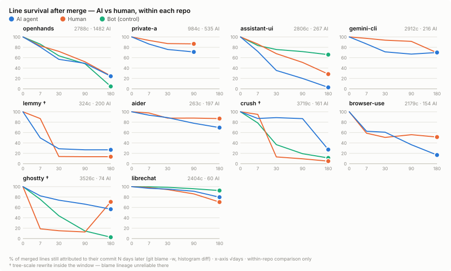

[](https://pypi.org/project/git-aftermerge/)
[](https://pypi.org/project/git-aftermerge/)
[](https://pypi.org/project/git-aftermerge/)
[](https://github.com/inthepond/git-aftermerge/actions)
[](https://inthepond.github.io/git-aftermerge/)
[](https://opensource.org/licenses/MIT)
[](https://github.com/astral-sh/ruff)

# git-aftermerge

> Track the downstream fate of every commit. Feed structured post-merge feedback to AI coding agents.


## What This Is

`git-aftermerge` is a Python CLI + MCP server that analyzes what happens to code *after* it gets merged — tracking survival, reverts, churn, and bug-fix correlations — then feeds structured feedback back to coding agents so they learn from their own history.

## Installation

```bash
pip install git-aftermerge
```

## Quick Start

```bash
# Initialize in your repo
cd /path/to/your/repo
git-aftermerge init

# How much AI-attributed history do you already have? (no init needed)
git-aftermerge attribution

# Survival curves: AI vs human vs bot cohorts, within this repo
git-aftermerge curve

# Check fate of a specific commit
git-aftermerge fate abc1234

# View aggregate patterns
git-aftermerge report

# Generate agent context file
git-aftermerge context --output .aftermerge/CONTEXT.md
```

Then in `CLAUDE.md`:

```markdown
## Post-Merge Context
See .aftermerge/CONTEXT.md for code survival data and risky areas.
```

## Findings: does AI code survive?

We ran git-aftermerge across open-source repos carrying AI attribution
(Claude Code, Cursor, Copilot, OpenHands, Gemini, …) and compared line
survival **within each repo** — AI-agent vs human vs deterministic bots
(Dependabot, the negative control):

<picture>
  <source media="(prefers-color-scheme: dark)" srcset="docs/assets/research/survival-curves-dark.svg">
  
</picture>

In most repos AI-agent lines churn measurably faster than human lines in the
same codebase; the exceptions are AI-native projects where human commits are
the ones being rewritten. Full charts, per-repo table, methodology, and
caveats: **[Findings →](https://inthepond.github.io/git-aftermerge/findings/)**

## How It Works

1. **Attribute** — assigns every commit a cohort (`ai-agent` / `bot` / `human`) from convention trailers (`Generated-By:`, `AI-Model:`, `AI-Session:`, `AI-Human-Ratio:`), existing traces (`Co-Authored-By: Claude`, Cursor/Copilot/aider/Devin), and bot identities. Dependabot & friends form a deterministic negative-control cohort.
2. **Scan** — parses git history (histogram diff, whitespace ignored) and stores *facts only*: commit metadata, per-file line counts, when each touched file was previously modified, detected reverts/fix-links, and blame snapshots at 7/30/90/180/365 days + HEAD.
3. **Derive** — survival scores, fate labels, maturity tiers (new / young / mature code), patterns, and survival curves are all computed at query time, so metric definitions can change without a rescan.
4. **Compare** — `curve` shows the fraction of each cohort's lines still alive T days after merge, cross-cut by the maturity of the code touched. Within-repo comparison by design: project maturity, team, and domain are held constant.
5. **Serve** — exposes everything via CLI, JSON, markdown context, or MCP tools.

## MCP Server

Add to your MCP config (`claude_desktop_config.json` or equivalent):

```json
{
  "mcpServers": {
    "aftermerge": {
      "command": "git-aftermerge",
      "args": ["mcp-serve"],
      "cwd": "/path/to/your/repo"
    }
  }
}
```

Available MCP tools:
- `aftermerge_get_fate` — fate of a specific commit
- `aftermerge_get_patterns` — aggregate survival patterns
- `aftermerge_get_risky_areas` — directories with lowest survival scores
- `aftermerge_get_recent_failures` — recent reverts and bug-fix correlations
- `aftermerge_get_survival_curves` — cohort × maturity survival curves
- `aftermerge_get_context` — markdown summary for agent injection

## CLI Reference

```
git-aftermerge init           Initialize tracking in current repo
git-aftermerge scan           Update commit facts and observations
git-aftermerge attribution    Detect AI/bot attribution in any repo (no DB needed)
git-aftermerge curve          Survival curves by cohort / code maturity
git-aftermerge fate <sha>     Show fate of a specific commit
git-aftermerge report         Show aggregate patterns
git-aftermerge context        Generate agent-consumable context file
git-aftermerge watch          Watch for new commits and auto-scan
git-aftermerge mcp-serve      Start MCP server (stdio)
```

## Contributing

```bash
git clone https://github.com/inthepond/git-aftermerge.git
cd git-aftermerge
pip install -e ".[dev]"
pytest
```

## License

MIT
